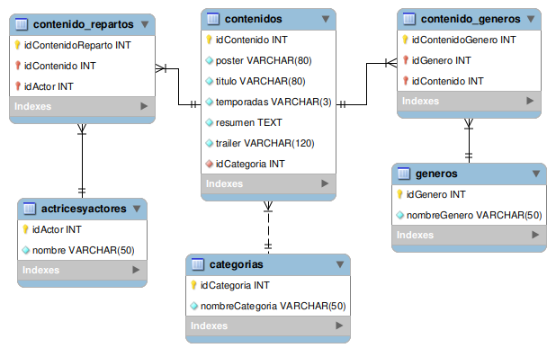

## Tercer Proyeto Integrador 


 Aplicacion simple para catalogar peliculas o series. Creada en NodeJS usando bases de datos MySQL.


#### Especificaciones
- Servidor: http://127.0.0.1:3000
- Versión: 1.0.0
- Autor: **Okuda Santiago**
- Repositorio GitHub: git+ https://github.com/shokuda/TercerProyectoIntegrador.git

#### Requerimientos
- Node.js v20.5.1
- MySQL2 v3.6.1
- GIT v2.40.1
- IDE - Visual Studio Code v1.82.2

#### Estructura de directorios
```
TercerProyectoIntegrador/
┣ models/
┃ ┣ actricesyactores.js
┃ ┣ categoria.js
┃ ┣ contenido_generos.js
┃ ┣ contenido_repartos.js
┃ ┣ contenidos.js
┃ ┣ generos.js
┃ ┗ index.js
┣ routes/
┃ ┗ contenido.js
┣ src/
┃ ┣ conection/
┃ ┃ ┗ canection.js
┃ ┗ server.js
┣ .env
┣ .env_dist
┣ .eslintrc.json
┣ .gitignore
┣ README.md
┣ Create_View.sql
┣ TrailerflixDBCreate.sql
┣ package-lock.json
┗ package.json
```

---
### CONFIGURACION DE ENTORNO

- Copiar el archivo **.env.dist** y renomrarlo a **.env**.
- Dentro del archivo **.env** asignar valores correspondientes a:
  `PORT`, `HOST`, `DBUSER`, `DATABASE`, `DBPASSWORD` y `DBHOST`
- Script para la creacion de la base de datos Trailerflix: **TrailerflixDBCreate.sql**.
- Script para la creacion de la vista: **Create_View.sql**.


---

#### Métodos HTTP
| Tipo | URI | Descripción | Ejemplo | Tipo-Parámetro |
|-----|-----|-------------|---------|---------------|
| GET | http://127.0.0.1:3000/catalogo | Devuelve la vista de todos los elementos.|||
| GET | http://127.0.0.1:3000/catalogo/contenido/:id | Muestra el contenido a partir del id.|http://127.0.0.1:3000/catalogo/contenido/1|INTEGER|
| GET | http://127.0.0.1:3000/catalogo/genero/:genero | Lista los contenidos por genero. |http://127.0.0.1:3000/catalogo/genero/Drama|STRING|
| GET | http://127.0.0.1:3000/catalogo/categoria/:categoria |  Lista contenidos por categoría.|http://127.0.0.1:3000/catalogo/categoria/Serie|INTEGER|
| GET | http://127.0.0.1:3000/catalogo/nombre/:nombre | Lista por nombre de contenido o parte del nombre.|http://127.0.0.1:3000/catalogo//nombre/The|STRING|
| GET | http://127.0.0.1:3000/catalogo/actores/:idContenido | Lista el reparto del contenido | http://127.0.0.1:3000/catalogo/actores/5|INTEGER|
| GET | http://127.0.0.1:3000/catalogo/categorias | Lista todas las categorias. |||


---


#### Estructura de la base de datos

